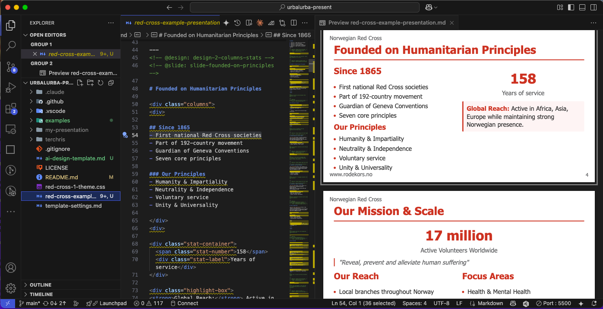

# Urbalurba Presentation System

> *"Stop wasting time on how your presentation looks. Spend time on what you know - your subject."*

A presentation framework that transforms how you create professional presentations. **You focus on your expertise and content, AI handles all the design decisions and creates stunning presentations that follow best practices for conveying your message.**

## 🧠 Your Knowledge + AI = Professional Results

**Important:** This system doesn't generate content for you. **YOU provide the expertise, knowledge, and ideas.** The AI simply takes your raw content (workshop notes, bullet points, research findings) and transforms it into professionally structured slides with optimal design patterns.

**You're the expert. AI is your presentation designer.**

## ✨ What This System Does

**Transforms presentation creation from complex design work to pure content focus:**

- 🤖 **AI Organizes Your Content** - You provide the knowledge, AI handles structure and design decisions
- 🎨 **Best Practice Layouts Automatically Applied** - Proven patterns for maximum message impact
- 🏢 **Professional Branding Built-In** - Currently supports Norwegian Red Cross, expanding to more organizations
- 🚀 **15+ Presentation Patterns** - Title slides, data visualization, storytelling, technical content, and more  
- 📱 **Multiple Output Formats** - HTML, PDF, and PowerPoint presentations that work perfectly on any device
- 🧠 **Message-Focused Design** - Every layout optimized for clear communication and audience engagement
- 🤖 **AI Loves text** - AI is built into vscode and will help you write.
- 🔓 **presentation is not locked into a specific tool** - Just as in free speech, your text should not be locked into a proprietary format that someone else controls.

## 📋 Example Presentation Output
From simple markdown notes to presentation in 3 formats:

- **HTML** - [Interactive web presentation with speaker notes](https://terchris.github.io/urbalurba-present/examples/red-cross-example-presentation.html)
- **PDF** - [Print-ready format for handouts and documentation](https://terchris.github.io/urbalurba-present/examples/red-cross-example-presentation.pdf)
- **PowerPoint** - [Editable slides for Microsoft PowerPoint](https://github.com/terchris/urbalurba-present/raw/main/examples/red-cross-example-presentation.pptx)

The presentation content / the text is in a simple markdown file, which you can edit in any text editor. **Source:** [`red-cross-example-presentation.md`](red-cross-example-presentation.md)

## 🎯 Key Benefits

- **🤖 AI Organizes Your Content** → Provide your expertise and raw ideas, get professionally structured slides following communication best practices
- **⚡ 95% Faster** → From idea to professional presentation in minutes, not hours  
- **🎨 No Design Skills Needed** → Focus on your message, AI handles all visual design decisions
- **🏢 Brand Compliance Built-In** → Every slide automatically follows organizational standards
- **📱 Modern Output** → HTML, PDF, and PowerPoint formats that work everywhere

## 🔧 How It Works

### Simple 4-Step Process:

1. **📝 You Provide Your Expertise** → Add your knowledge, research, and ideas to `presentation-input.md` (workshop notes, bullet points, findings, etc.)
2. **🤖 AI Structures Your Content** → AI reads your expertise + organization settings, generates `my-presentation.md` with professional slide layouts and design patterns
3. **✏️ You Refine & Iterate** → Edit `my-presentation.md` like working in PowerPoint - modify content, reorder slides, adjust messaging. Export anytime to see results
4. **🎨 System Generates Output** → Convert to HTML, PDF, or PowerPoint with perfect branding and professional design



### The Magic:
- **You provide the expertise** - Your knowledge, research findings, and ideas are the foundation
- **AI organizes professionally** - Optimal layouts for each content type (stats → data visualization, stories → image layouts, etc.)
- **You maintain full control** to edit, iterate, and perfect your presentation
- **Instant preview** by exporting during your editing process
- **Automatic brand compliance** using your organization's colors, fonts, and imagery built into every design pattern

**For detailed step-by-step instructions with screenshots, see the [complete how-to guide](doc/howto.md).**

## 🚀 Quick Start

### 1. Install the System

**Mac/Linux:**
```bash
curl -L $(curl -s https://api.github.com/repos/terchris/urbalurba-present/releases/latest | grep "browser_download_url.*urbalurba-present.zip" | cut -d '"' -f 4) -o urbalurba-present.zip && unzip urbalurba-present.zip -d urbalurba-present && rm urbalurba-present.zip && ./urbalurba-present/initiate.sh
```

**Windows (PowerShell):**
```powershell
$url = (Invoke-RestMethod "https://api.github.com/repos/terchris/urbalurba-present/releases/latest").assets | Where-Object {$_.name -eq "urbalurba-present.zip"} | Select-Object -ExpandProperty browser_download_url
Invoke-WebRequest -Uri $url -OutFile "urbalurba-present.zip"
Expand-Archive -Path "urbalurba-present.zip" -DestinationPath "." -Force
Remove-Item "urbalurba-present.zip"
.\urbalurba-present\initiate.bat
```

**What this one command does:**
- Downloads the latest Urbalurba system
- Extracts it to `urbalurba-present/` folder
- Runs the setup script automatically
- Copies `template-settings.md` to your project root
- Creates a starter `presentation-input.md` file
- Sets up VS Code settings for Marp

You'll see output like:
```
🚀 Initiating Urbalurba Presentation System...
📄 Copying template-settings.md...
📝 Creating presentation-input.md...
⚙️  Setting up VS Code configuration...
🎉 Setup complete! Your project is ready.
```

### 2. Open VS Code and Edit Your Files
```bash
# Open VS Code in your project
code .
```

**Edit these files in VS Code:**
- **`template-settings.md`** - Configure your organization (name, website, logo, theme)
- **`presentation-input.md`** - Add your presentation content and ideas

**Available themes to choose from (use just the name):**
- `red-cross-1-theme` (Humanitarian/NGO)
- `cnn-theme` (Media/News)
- `dnb-bank-theme` (Financial/Corporate)
- `un-theme` (International/Diplomatic)

The `initiate.sh` script creates a starter file with this structure:
```markdown
# My Presentation Ideas

## Main Topics
- Add your main presentation topics here
- Key messages you want to convey
- Important statistics or data points

## Call to Action
- What do you want your audience to do?
- Next steps for engagement
```

### 3. AI Creates Initial Structure

```bash
claude code
````

At the prompt type:

```plaintext
I need you to create a presentation. Please start by reading urbalurba-present/ai-instructions.md and following those instructions exactly.
```

>Claude will automatically read your files and create my-presentation.md

### 4. Edit & Iterate Your Presentation

Edit `my-presentation.md` in VS Code to refine your presentation. You can:
- Modify content directly in the markdown file
- Reorder slides by moving sections around
- Adjust messaging and add details as needed
- Export to preview results (see the [howto guide](doc/howto.md) for details)

## 🎨 Available Themes

Choose from professionally designed themes in the `themes/` folder:

| Theme | Organization | Best For | Key Features |
|-------|-------------|----------|--------------|
| **red-cross-1-theme.css** | Norwegian Red Cross | Humanitarian/NGO | Red & white colors, clean layout |
| **cnn-theme.css** | CNN News | Media/News | Bold typography, news-style layout |
| **dnb-bank-theme.css** | DNB Bank | Financial/Corporate | Professional blue, banking aesthetic |
| **un-theme.css** | United Nations | International/Diplomatic | UN blue, global organization style |

**To use a theme:** Update the `theme_name` setting in `template-settings.md` to your chosen theme (e.g., `cnn-theme`).

## 📋 Available Design Patterns

| Pattern | Best For | Key Features |
|---------|----------|--------------|
| **Title Slides** | Opening/closing | Organization logo, centered branding |
| **Two-Column Layouts** | Comparisons, before/after | Balanced content distribution |
| **Statistics & Data** | Key metrics, impact numbers | Visual emphasis on important figures |
| **Image + Text** | Storytelling, case studies | Professional photography integration |
| **Video Integration** | Demonstrations, testimonials | Embedded YouTube videos |
| **Section Dividers** | Chapter breaks | Clean transitions between topics |
| **Call-to-Action Grids** | Next steps, contact info | Organized action items |
| **Technical Content** | Code examples, diagrams | Syntax highlighting, flowcharts |
| **Metrics Dashboards** | KPIs, achievements | Professional data visualization |

## 🛠️ Setup Requirements

### Required Software

**Install in this order:**

1. **Node.js** - [Download and install](https://nodejs.org/en/download/) (required for Marp CLI)
2. **VS Code** - [Download and install](https://code.visualstudio.com/download) if you don't have it
3. **Marp CLI** - Install via npm (requires Node.js):
   ```bash
   npm install -g @marp-team/marp-cli
   ```
4. **Marp VS Code Extension** - [Install from VS Code Marketplace](https://marketplace.visualstudio.com/items?itemName=marp-team.marp-vscode)
5. **Claude Pro/Team Subscription** - [Subscribe to Claude](https://claude.ai/upgrade) for AI presentation creation
6. **Claude Code** - [Install Claude Code](https://docs.anthropic.com/en/docs/claude-code) for AI-powered file editing

**Benefits of VS Code + Marp Extension:**

- Separating content from design
- Live preview while editing
- Easy export options (PDF, PowerPoint, HTML) via Command Palette
- Syntax highlighting for presentation markdown

## 📊 Real-World Impact

**Traditional Approach:**

- Hours spent on design and layout decisions
- Inconsistent messaging and visual presentation
- Design skills required for professional results
- Manual application of communication best practices

**With Urbalurba + AI:**

- Focus 100% on your content and message
- AI automatically applies proven communication patterns
- Professional results without design expertise
- Best practices for audience engagement built-in
- 95% faster from idea to finished presentation

## 📁 Live Examples

### 🤖 See Claude Code in Action

**[Complete Claude Code Session](doc/claude-output-example.md)** - Full transcript showing exactly what happens when you run Claude Code with the Urbalurba system. See the AI read files, analyze content, and generate a complete presentation step-by-step.

*Perfect for understanding the workflow before you try it yourself.*


### 📄 How the he Presentation was created:
1. Open `red-cross-example-presentation.md` in VS Code
2. Use the Marp extension export button (see [plugin documentation](https://marketplace.visualstudio.com/items?itemName=marp-team.marp-vscode) for details)
3. Export to HTML, PDF, and PowerPoint formats directly from VS Code

These examples demonstrate all 15+ design patterns in a real-world presentation showcasing Norwegian Red Cross programs and services.

## 📖 Background Story

**[From Post-it Notes to Professional Presentations: How AI Became My Design Partner](https://github.com/terchris/urbalurba-present/blob/main/doc/blog1.md)** - The personal story behind building this system. Read how a simple workshop with colleagues led to discovering a better way to create presentations, and why AI makes the perfect design partner for people who know their subject but struggle with slide layouts.

*Perfect for understanding the motivation and real-world problem this system solves.*

## 🎓 Training Resources

- **`template-settings.md`** - Organization configuration variables
- **`ai-design-template.md`** - Complete AI guide for all design patterns  
- **`red-cross-example-presentation.md`** - Full working example with all patterns

## 🤝 Support & Community

**For questions or improvements:**
- Technical issues: Create GitHub issue
- Content guidance: Reference the design guide
- New features: Submit feature requests

---

## About This Project

Built with [Marp framework](https://marp.app/) and designed to revolutionize how you  create presentations. The system combines proven communication design patterns with AI-powered content optimization to ensure every presentation achieves maximum impact.

**Available Themes:**
- **Norwegian Red Cross** - Humanitarian/NGO organizations (red-cross-1-theme.css)
- **CNN News** - Media and news organizations (cnn-theme.css)  
- **DNB Bank** - Financial and corporate organizations (dnb-bank-theme.css)
- **United Nations** - International and diplomatic organizations (un-theme.css)

**System Architecture:**
- `template-settings.md` - Organization variables (logos, colors, images, theme selection)
- `ai-design-template.md` - Generic AI instructions using variables
- `themes/` - Professional visual themes for different organization types
- `examples/` - Live demonstrations in HTML, PDF, and PowerPoint formats

*Created by Urbalurba to transform presentation creation through AI-powered design automation.*
