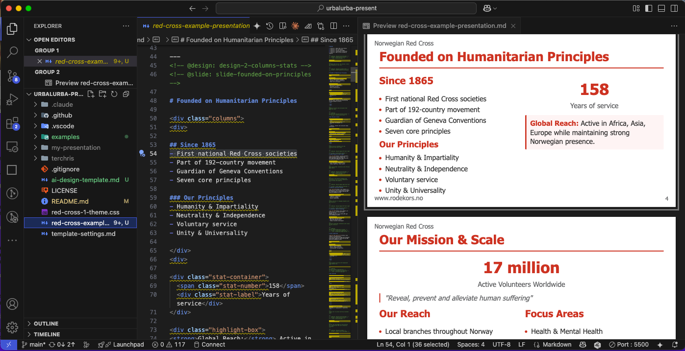

# Complete How-To Guide: Creating Presentations with Urbalurba + Claude Code

> *"Stop wasting time on how your presentation looks. Spend time on what you know - your subject."*

This detailed guide walks you through the complete process of creating professional presentations using the Urbalurba system with Claude Code.

## Prerequisites

Before starting, ensure you have all required software installed (see main README.md for installation links):

- ✅ Claude Pro/Team Subscription
- ✅ Claude Code
- ✅ VS Code
- ✅ Node.js
- ✅ Marp CLI (`npm install -g @marp-team/marp-cli`)
- ✅ Marp for VS Code extension

## Step-by-Step Walkthrough

### Step 1: Install and Setup

1. **Download the Urbalurba system** using the curl command from the README
2. **Install the Marp for VS Code extension** from [VS Code Marketplace](https://marketplace.visualstudio.com/items?itemName=marp-team.marp-vscode)
3. **Configure VS Code settings** (if you don't already have `.vscode` folder):
   ```bash
   # Only copy if .vscode folder doesn't exist yet
   if [ ! -d ".vscode" ]; then
     cp -r urbalurba-present/.vscode .
   else
     echo "Warning: .vscode folder already exists. Check urbalurba-present/.vscode for Marp settings to merge manually."
   fi
   ```

### Step 2: Configure Your Organization

Edit `template-settings.md` to replace Norwegian Red Cross settings with your organization's:

```yaml
organization_name: "Your Organization"
website: "www.yourorg.com"
logo_url: "https://your-logo-url.com/logo.svg"
header_text: "Your Organization"
footer_text: "www.yourorg.com"
theme_file: "your-theme.css"  # or use red-cross-1-theme.css as starting point
```

**Important:** Update all image URLs and video settings to match your organization's media assets.

### Step 3: Create Your Content Input

Create `presentation-input.md` with your raw content. This can be:
- Workshop notes
- Bullet points from meetings
- Email content
- Research findings
- Any text describing what you want to present

**Example:**
```markdown
# Project Update Presentation

## Main Topics
- Q3 Results exceeded expectations
- New AI automation reduced processing time by 67%
- Customer satisfaction scores: 94% (up from 78%)
- Team expanded from 5 to 12 people

## Key Statistics
- 15,000 transactions processed
- $2.3M revenue increase
- 45% efficiency improvement

## Next Steps
- Expand to European markets
- Hire 3 additional developers
- Q4 target: $5M revenue
```

### Step 4: Use Claude Code to Create Your Presentation

1. **Launch Claude Code** in your project directory:
   ```bash
   claude code
   ```

2. **Give Claude the instruction:**
   ```
   Please read and follow ai-instructions.md
   ```

3. **Claude will automatically:**
   - Read your `presentation-input.md` content
   - Apply your organization settings from `template-settings.md`
   - Follow design patterns from `ai-design-template.md`
   - Create `my-presentation.md` with proper structure and branding

### Step 5: Edit and Iterate in VS Code



*The screenshot above shows the VS Code interface with the Marp extension active, displaying the presentation markdown on the left and live preview on the right.*

1. **Open your project in VS Code:**
   ```bash
   code .
   ```

2. **Open `my-presentation.md`** - you'll see the structured presentation Claude created

3. **Use the Marp extension features:**
   - **Live preview** - See your slides update in real-time as you edit
   - **Export options** - Use Command Palette (`Cmd+Shift+P`) → "Marp: Export Slide Deck"
   - **Slide navigation** - Jump between slides in the preview pane

For complete details on VS Code features, see the [official Marp extension documentation](https://marketplace.visualstudio.com/items?itemName=marp-team.marp-vscode).

### Step 6: Export Your Presentation

The Marp extension provides multiple export options through VS Code:

1. **Open Command Palette** (`Cmd+Shift+P` on Mac, `Ctrl+Shift+P` on Windows)
2. **Type "Marp"** to see available commands
3. **Select export format:**
   - "Marp: Export Slide Deck" → Choose HTML, PDF, or PowerPoint
   - Or use individual commands like "Marp: Export to HTML"

**Alternative: Command Line Export**
```bash
# HTML (for web sharing)
marp my-presentation.md --theme urbalurba-present/red-cross-1-theme.css -o my-presentation.html

# PDF (for handouts)  
marp my-presentation.md --theme urbalurba-present/red-cross-1-theme.css --pdf

# PowerPoint (for Office workflows)
marp my-presentation.md --theme urbalurba-present/red-cross-1-theme.css --pptx
```

## Iteration Workflow

The power of this system is in the iteration cycle:

1. **Edit content** in `my-presentation.md`
2. **See live preview** in VS Code
3. **Export quickly** to test with others
4. **Refine and repeat**

You can export multiple times during editing to share drafts, get feedback, and perfect your presentation.

## Advanced Usage

### Custom Design Patterns
If you need design patterns not covered in the standard set, you can:
- Study the `ai-design-template.md` structure
- Add custom CSS to your theme file
- Create new pattern specifications

### Multiple Organization Templates
To support multiple organizations:
1. Create separate settings files: `template-settings-org1.md`, `template-settings-org2.md`
2. Update the `ai-instructions.md` to reference the appropriate settings file
3. Maintain separate theme CSS files for each organization

### Integration with Existing Workflows
- **Version control**: Commit both markdown and exported files
- **Team collaboration**: Share markdown files for collaborative editing
- **Automation**: Use Marp CLI in CI/CD pipelines for automated presentation generation

## Troubleshooting

### Common Issues

**Marp extension not working:**
- Ensure your markdown file has `marp: true` in the frontmatter
- Check that the theme file path is correct
- Restart VS Code if preview doesn't appear

**Export fails:**
- Verify Marp CLI is installed globally: `npm list -g @marp-team/marp-cli`
- Check theme file exists at the specified path
- Ensure output directory has write permissions

**Images/videos not displaying:**
- Verify URLs in `template-settings.md` are accessible
- Check that image URLs return actual images (test in browser)
- Ensure video IDs are correct for YouTube embeds

### Getting Help

- **Marp Extension Issues**: See [official documentation](https://marketplace.visualstudio.com/items?itemName=marp-team.marp-vscode)
- **Claude Code Issues**: Check [Claude Code documentation](https://docs.anthropic.com/en/docs/claude-code)
- **Design Patterns**: Reference `ai-design-template.md` for specifications

## Best Practices

1. **Start with content, not design** - Focus on your message first
2. **Use the iteration cycle** - Export early and often for feedback
3. **Keep slides focused** - One main idea per slide
4. **Test your exports** - Verify all formats work before presenting
5. **Save your input** - Keep `presentation-input.md` for future reference

## Next Steps

Once you're comfortable with the basic workflow:
- Explore advanced design patterns in `ai-design-template.md`
- Customize your organization's theme CSS
- Create templates for common presentation types
- Set up automated workflows for regular presentations

Remember: The goal is to spend your time on what you know best - your subject matter - while letting AI handle the design and structure.