---

marp: true
theme: red-cross-1-theme
paginate: true
header: 'Norwegian Red Cross'
footer: 'www.rodekors.no'
---
<!-- @design: design-title -->
<!-- @slide: slide-title-norwegian-red-cross -->
<!-- _class: title -->


# Norwegian Red Cross Presentation Template

## A Modern, Customizable Slide Deck 
**Norwegian Red Cross** | **June 2025** | **Oslo**

---
<!-- @design: design-agenda -->
<!-- @slide: slide-agenda -->

# Agenda

1. Section 1: About Red Cross Norway
2. Section 2: Our Activities
3. Section 3: Current Challenges
4. Section 4: Technology & Innovation
5. Section 5: What Can We Accomplish Together

---
<!-- @design: design-section-divider -->
<!-- @slide: slide-section-1-intro -->
<!-- _class: section-divider -->

# Section 1
## About Red Cross Norway

<!--
Introduce who we are, our mission, scale, and foundation of our work.
-->

---
<!-- @design: design-2-columns-stats -->
<!-- @slide: slide-founded-on-principles -->

# Founded on Humanitarian Principles

<div class="columns">
<div>

## Since 1865
- First national Red Cross societies
- Part of 192-country movement
- Guardian of Geneva Conventions
- Seven core principles

### Our Principles
- Humanity & Impartiality
- Neutrality & Independence  
- Voluntary service
- Unity & Universality

</div>
<div>

<div class="stat-container">
  <span class="stat-number">158</span>
  <div class="stat-label">Years of service</div>
</div>

<div class="highlight-box">
<strong>Global Reach:</strong> Active in Africa, Asia, Europe while maintaining strong Norwegian presence.
</div>

</div>
</div>

<!--
Emphasize history and principles that guide our work.
-->

---
<!-- @design: design-2-rows-top-text-bottom-columns -->
<!-- @slide: slide-mission-scale -->

# Our Mission & Scale

<div class="stat-container">
  <span class="stat-number">17 million</span>
  <div class="stat-label">Active Volunteers Worldwide</div>
</div>

> *"Reveal, prevent and alleviate human suffering"*

<div class="columns">
<div>

## Our Reach
- Local branches throughout Norway
- International presence globally
- Volunteer-based organization
</div>
<div>

## Focus Areas
- Health & Mental Health
- Water & Sanitation
- Protection & Integration
</div>
</div>

<!--
Simple mission statement with key statistics and focus areas.
-->

---
<!-- @design: design-image-left-text-right -->
<!-- @slide: slide-global-network -->
# Global Network & Local Impact


## Our Connection
- Part of 191-country network
- Local Norwegian community focus
- Global expertise, local action

<!--
Show local-global connection with official IFRC emblem.
-->

---
<!-- @design: design-section-divider -->
<!-- @slide: slide-section-2-intro -->
<!-- _class: section-divider -->
# Section 2
## Our Activities

<!--
Overview of the diverse programs and activities we run to serve communities across Norway and globally.
-->

---
<!-- @design: design-image-right-text-left -->
<!-- @slide: slide-community-learning -->
# Community Learning Programs


## Norwegian Language Training
- Free practice sessions
- Community integration
- Cultural exchange
- Social connections

<!--
Simple overview of language programs with key statistic.
-->

---
<!-- @design: design-image-left-text-right -->
<!-- @slide: slide-innovation-health -->
# Innovation: Health Technology


## Nyss Platform
- Community health surveillance
- SMS early warning system
- Real-time health alerts
- Global volunteer development

<!--
Showcase technology innovation with visual and key statistic.
-->

---
<!-- @design: design-image-background-2-columns -->
<!-- @slide: slide-youth-leadership -->
<!-- _class: background-image-overlay -->

# Youth Leadership


<div class="columns">
<div>

## Ages 13-30
- Leadership development
- Mental health campaigns
- Social integration events
- International collaboration

</div>
<div>

<div class="stat-container">
  <span class="stat-number">1,000+</span>
  <div class="stat-label">Youth volunteers in Bergen</div>
</div>

</div>
</div>

<!--
Youth program overview with background image behind text.
-->


---
<!-- @design: design-2-columns-highlight-box -->
<!-- @slide: slide-get-involved-grid -->
<!-- _class: grid-with-highlight -->

# Get Involved

<div class="involvement-grid">

<div class="involvement-card">
<h3>Language Training</h3>
<p>Facilitate Norwegian practice sessions</p>
<a href="#" class="cta-button">Teach Now</a>
</div>

<div class="involvement-card">
<h3>Youth Mentoring</h3>
<p>Guide young leaders in their development</p>
<a href="#" class="cta-button">Mentor</a>
</div>

<div class="involvement-card">
<h3>First Aid Training</h3>
<p>Become a certified instructor</p>
<a href="#" class="cta-button">Instruct</a>
</div>

<div class="involvement-card">
<h3>Technology</h3>
<p>Contribute your digital skills</p>
<a href="#" class="cta-button">Code</a>
</div>

</div>

<div class="highlight-box">
<strong>Anyone can volunteer</strong> - regardless of background or experience
</div>

<!--
Simple call to action with key volunteer roles.
-->

---
<!-- @design: design-section-divider -->
<!-- @slide: slide-section-3-intro -->
<!-- _class: section-divider -->

# Section 3
## Current Challenges

<!--
Discuss the challenges we face and how we're addressing them with innovative solutions.
-->

---
<!-- @design: design-2-columns -->
<!-- @slide: slide-current-challenges -->

# Current Challenges


<div class="columns">
<div>

## What We Face
- Climate change impacts
- Social isolation 
- Integration needs
- Digital divides
</div>
<div>

## Our Response
- Innovation & technology
- Community-based solutions
- Enhanced training programs
</div>
</div>

<!--
Simple challenge overview with response strategy.
-->

---
<!-- @design: design-section-divider -->
<!-- @slide: slide-section-4-intro -->
<!-- _class: section-divider -->
# Section 4
## Technology & Innovation

<!--
Showcase how we use technology to enhance our humanitarian work and create greater impact.
-->

---
<!-- @design: design-2-rows-text-image -->
<!-- @slide: slide-innovation-action -->
<!-- _class: content-then-image -->
# Innovation in Action

<div class="top-content">


- **Digital Volunteer Platform**: Streamlined coordination system connecting 43,000+ volunteers nationwide
- **Emergency Response App**: Real-time disaster reporting and resource allocation, reducing response time by 65%
- **AI-Powered Search & Rescue**: Machine learning algorithms improving mountain rescue success rates by 40%
</div>

<div class="full-width-image">
  
</div>

<!--
Showcase solutions with key improvement metric.
-->

---
<!-- @design: design-code-snippet -->
<!-- @slide: slide-innovation-nyss -->
# Technology Innovation: Nyss Platform

```javascript
// SMS Health Alert Processing
function processAlert(smsData) {
    const alert = {
        location: smsData.coordinates,
        symptoms: parseSymptoms(smsData.message),
        volunteer: smsData.volunteerId
    };
    
    if (isEpidemicRisk(alert.symptoms)) {
        sendRealTimeAlert(alert);
    }
}
```

<!--
Tech innovation example with visual code snippet.
-->

---
<!-- @design: design-mermaid-diagram -->
<!-- @slide: slide-innovation-system-architecture -->
# Our System Architecture

```mermaid
flowchart TB
    subgraph "User Interface Layer"
        Mobile[📱 Mobile Apps]
        Web[🌐 Web Portal]
        SMS[📟 SMS Gateway]
    end
    
    subgraph "API Gateway"
        Gateway[🔀 API Gateway<br/>Authentication & Routing]
    end
    
    subgraph "Core Services"
        Volunteer[👥 Volunteer<br/>Management]
        Emergency[🚨 Emergency<br/>Response]
        Health[⚕️ Health Surveillance<br/>Nyss Platform]
        Training[📚 Training &<br/>Certification]
    end
    
    subgraph "AI & Analytics"
        ML[🤖 Machine Learning<br/>Search & Rescue]
        Analytics[📊 Data Analytics<br/>& Reporting]
    end
    
    subgraph "Data Layer"
        UserDB[(👤 User Database)]
        EventDB[(📋 Event Database)]
        HealthDB[(⚕️ Health Data)]
        GeoDB[(🗺️ Geographic Data)]
    end
    
    subgraph "External Systems"
        IFRC[🌍 IFRC Global Network]
        Gov[🏛️ Government APIs]
        Weather[🌤️ Weather Services]
    end
    
    %% User Interface Connections
    Mobile --> Gateway
    Web --> Gateway
    SMS --> Gateway
    
    %% Gateway to Services
    Gateway --> Volunteer
    Gateway --> Emergency
    Gateway --> Health
    Gateway --> Training
    
    %% Services to AI/Analytics
    Emergency --> ML
    Health --> Analytics
    Volunteer --> Analytics
    
    %% Services to Data
    Volunteer --> UserDB
    Emergency --> EventDB
    Health --> HealthDB
    Training --> UserDB
    ML --> GeoDB
    
    %% External Integrations
    Health --> IFRC
    Emergency --> Gov
    Emergency --> Weather
    ML --> GeoDB
    
    %% Styling
    classDef userInterface fill:#DA291C,stroke:#fff,stroke-width:2px,color:#fff
    classDef coreService fill:#6D6E70,stroke:#fff,stroke-width:2px,color:#fff
    classDef aiAnalytics fill:#E5E5E5,stroke:#DA291C,stroke-width:2px,color:#333
    classDef database fill:#333,stroke:#DA291C,stroke-width:2px,color:#fff
    classDef external fill:#fff,stroke:#DA291C,stroke-width:2px,color:#DA291C
    
    class Mobile,Web,SMS userInterface
    class Volunteer,Emergency,Health,Training coreService
    class ML,Analytics aiAnalytics
    class UserDB,EventDB,HealthDB,GeoDB database
    class IFRC,Gov,Weather external
```



<!--
A diagram of our system architecture.
-->

---
<!-- @design: design-section-divider -->
<!-- @slide: slide-section-5-intro -->
<!-- _class: section-divider -->
# Section 5
## What Can We Accomplish Together

<!--
Inspiring vision of future possibilities when community, technology, and humanitarian values unite.
-->

---
<!-- @design: design-grid-3-rows -->
<!-- @slide: slide-impact-dashboard -->
<!-- _class: metrics-grid -->
# Key Impact Metrics

<div class="metrics-grid">

<div class="metric-card">
<div class="metric-icon">👥</div>
<div class="metric-number">43,000+</div>
<div class="metric-label">Active Volunteers</div>
</div>

<div class="metric-card">
<div class="metric-icon">⏱️</div>
<div class="metric-number">65%</div>
<div class="metric-label">Faster Emergency Response</div>
</div>

<div class="metric-card">
<div class="metric-icon">🎯</div>
<div class="metric-number">40%</div>
<div class="metric-label">Better Rescue Success Rate</div>
</div>

<div class="metric-card">
<div class="metric-icon">🌍</div>
<div class="metric-number">191</div>
<div class="metric-label">Countries in Network</div>
</div>

<div class="metric-card">
<div class="metric-icon">📚</div>
<div class="metric-number">1,300</div>
<div class="metric-label">Trained Responders</div>
</div>

<div class="metric-card">
<div class="metric-icon">💡</div>
<div class="metric-number">158</div>
<div class="metric-label">Years of Innovation</div>
</div>

</div>

<!--
Inspiring future vision with visual focus.
-->

---
<!-- @design: design-quote -->
<!-- @slide: slide-questions-discussion -->
<!-- _class: lead -->

# Questions & Discussion

*"The power of humanity is in our hands"*

<!--
Invite questions. Be ready to elaborate on any topic or share additional stories.
-->

---
<!-- @design: design-title -->
<!-- @slide: slide-thank-you -->
<!-- _class: title -->


# Thank You

## Building Stronger Communities Through Technology and Compassion

**www.rodekors.no**

<!--
Thank the audience for their time and attention. End on a positive note about how technology and human compassion work together to build better communities.
-->